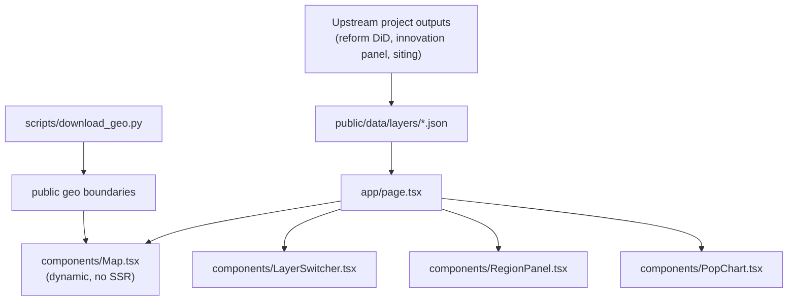

# PIP.REFORM

Interactive map dashboard visualizing four linked layers across EU NUTS2 regions: administrative-reform population impact, innovation archetype, deep-tech investment suitability, and GDP per capita. Built as the shared front-end for the [PL-Capital-Reform-DiD](https://github.com/andrm101/pl-capital-reform-did), [EU-Innovation-Panel](https://github.com/andrm101/eu-innovation-panel), and [EU-MegaCampus-Siting](https://github.com/andrm101/eu-megacampus-siting) research projects.

## Layers

| Layer | Source |
|---|---|
| `reform-impact` | Avg. population change in demoted capitals, 1999–2019 (PL-Capital-Reform-DiD) |
| `innovation` | Innovation archetype score by NUTS2 region (EU-Innovation-Panel) |
| `investment` | Deep-tech investment suitability score (EU-MegaCampus-Siting) |
| `gdp` | GDP per capita, PPS (Eurostat REGIO) |

## Architecture



## Stack

Next.js (App Router) + TypeScript + Tailwind CSS.

## Running it

```bash
npm install
python scripts/download_geo.py   # fetch region boundaries into public/
npm run dev
```

Open [http://localhost:3000](http://localhost:3000).

Requires a Mapbox token in `.env.local` (`NEXT_PUBLIC_MAPBOX_TOKEN`) — see `.env.local.example`.
